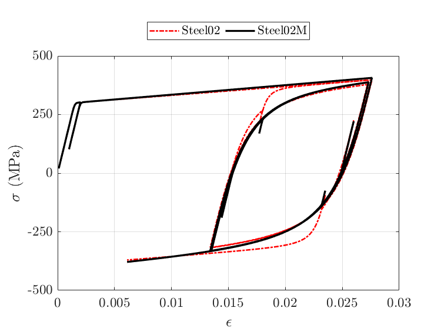
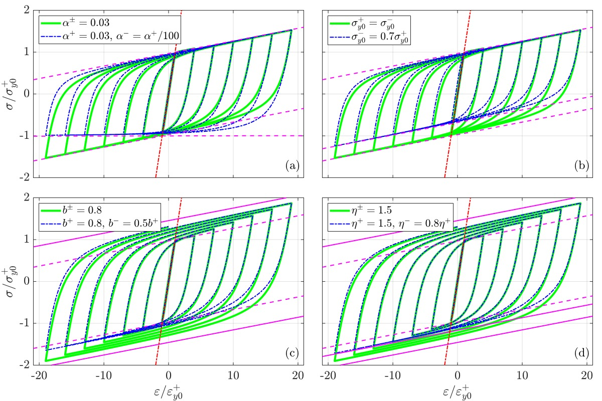

# Steel02M: An Improved Giuffr`e-Menegotto-Pinto Model

A well-known limitation of the Steel02 material model in OpenSees is that it causes overshooting on reloading upon a small partial unloading (see Figure 1). Steel02M eliminates this error through detection of overshooting followed by its elimination through curve selection, and controlling the Bauschinger effect. 

<p align="center">
  <br>
  <em>Figure 1 : Comparison of stress-strain response using Steel02 and Steel02M</em>
</p>

The proposed Steel02M model incorporates four additional features beyond the Steel02 material model, allowing independent definitions of material parameters in the positive and negative loading directions as illustrated in (see Figure 2):
 - strain hardening ratios $(\alpha^{\pm})$
 - initial yield strengths $(\sigma_{y0}^{\pm})$
 - isotropic hardening rates $(b^{\pm})$
 - saturation-to-initial yield strength ratios $(\eta^{\pm})$.

<p align="center">
  <br>
  <em>Figure 2 : llustration of the additional features incorporated in the Steel02M material model, showing independent definitions in the positive and negative directions of: (a) strain hardening ratios, (b) initial yield strengths, (c) isotropic hardening rates, and (d) saturation-to-initial yield strength ratios
    </em>
</p>

Steel02M  removes redundant parameters in isotropic hardening of Steel02 (see the equations below for isotropic hardening in Steel02 and Steel02M) 

**Steel02:**

$$
\sigma_y^{+} = \sigma_{y0}\left[1 + a_3 \left(\frac{\zeta}{a_4}\right)^{0.8}\right]
= \sigma_{y0}\left[1 + a^{+}\zeta^{0.8}\right]
$$

$$
\sigma_y^{-} = \sigma_{y0}\left[1 + a_1 \left(\frac{\zeta}{a_2}\right)^{0.8}\right]
= \sigma_{y0}\left[1 + a^{-}\zeta^{0.8}\right]
$$

$$
\zeta = \frac{\varepsilon_{\max}-\varepsilon_{\min}}{2\varepsilon_{y0}}
$$


**Steel02M:**

$$
\sigma_y^{\pm} = \sigma_{y0}^{\pm}\left[1 + a^{\pm}\zeta^{b^{\pm}}\right]
\quad \text{subject to } |\sigma_y^{\pm}| \le \eta^{\pm}|\sigma_{y0}^{\pm}|
$$

$$
\zeta = \frac{\varepsilon_{\max} - \varepsilon_{\min}}{\varepsilon_{y0}^{+} - \varepsilon_{y0}^{-}}
$$

$$
\varepsilon_{y0}^{\pm} = \frac{\sigma_{y0}^{\pm}}{E_0}
$$
    
### Input Syntax
```tcl
uniaxialMaterial Steel02M $matTag $E $FyPos $FyNeg $alphaPos $alphaNeg $R0 $cR1 $cR2 <$a_pos $a_neg> <$etaPos $etaNeg>  <$b_pos $b_neg>
```
| Parameter | Type  | Description                                                                |
| --------- | ----- | -------------------------------------------------------------------------- |
| $matTag | int   | Unique tag for this material instance                                      |
| $E   | float | Elastic Young’s modulus                                                            |
| $FyPos  | float | Initial yield strength in positive loading direction $$(\sigma_{y0}^{+})$$                             |
| $FyNeg  | float |  Initial yield strength in negative loading direction (must be negative) $$(\sigma_{y0}^{-})$$                           |
| $alphaPos   | float | Strain hardening ratio in positive loading direction $$(\alpha^{+})$$                                                 |
| $alphaNeg   | float | Strain hardening ratio in negative loading direction $$(\alpha^{-})$$  |
| $R0  | float |  Initial value of R that controls smoothness of transition                                                   |
| $cR1 | float | Controls the rate of change of R |
| $cR2   | float | Controls the rate of change of R|
| $a_pos   | float | Controls cyclic isotropic hardening in positive loading direction (default 0)     |
| $a_neg | float | Controls cyclic isotropic hardening in negative loading direction (default 0)  |
| $etaPos  | float |  Saturation to initial yield strength ratios in positive direction (default 1.5) $$(\eta^{+})$$ |
| $etaNeg   | float| Saturation to initial yield strength ratio in negative direction  (default 1.5) $$(\eta^{-})$$ |
| $b_pos  | float| Controls rate of cyclic isotropic hardening in positive direction (default 0.8) $$(b^{+})$$  |
| $b_neg   | float| Controls rate of cyclic isotropic hardening in negative direction (default 0.8) $$(b^{-})$$ |

### Example TCL Input 
This TCL input file generates the σ–ε response shown in the figure for the Steel02M material model.
```tcl
# -----------------------------
# Horizontal axial element(truss) with unit length and area with Steel02M material model
#Unit considered: N and mm
# -----------------------------
wipe
model BasicBuilder -ndm 2 -ndf 2
# -----------------------------
# Nodes
node 1 0.0 0.0
node 2 1.0 0.0
# -----------------------------
#Boundary condition
fix 1 1 1
fix 2 0 1
# -----------------------------
# Define Steel02M uniaxial material Arguments:
set matTag 1
set Fy 300
set FyPos $Fy; # FyPos: Positive yield stress
set FyNeg [expr -1*$Fy]; # FyNeg: Negative yield stress
set E 200000; # E: Elastic Young's modulus
set b 0.0196; # alpha: Post yield stiffness ratio
set R0 20.0; # R0: Initial transition curvature 
set cR1 0.916; # cR1:  Parameter controlling transition curvature 
set cR2 0.15; # cR2:  Parameter controlling transition curvature 
set a_pos 0.05; # Control rate of transition in positive loading direction
set a_neg 0.074; # Control rate of transition in negative loading direction
#uniaxialMaterial Steel02M $matTag $E $FyPos $FyNeg $alphaPos $alphaNeg $R0 $cR1 $cR2 <$a_pos $a_neg> <$etaPos $etaNeg>  <$b_pos $b_neg>
uniaxialMaterial Steel02M $matTag $E $FyPos $FyNeg $b $b $R0 $cR1 $cR2 $a_pos $a_neg
# -----------------------------
# Truss
set eleTag 1
set A 1.0
element truss $eleTag 1 2 $A $matTag
# -----------------------------
# Load pattern (reference load)
# -----------------------------
pattern Plain 1 Linear {
    load 2 1.0 0.0; # Apply unit horizontal load at Node 2
}
# -----------------------------
# Recorders
# -----------------------------
recorder Node -file node2_disp_exp.out -time -node 2 -dof 1 disp
recorder Element -file ele1_force_exp.out -time -ele 1 force
# -----------------------------
# Analysis components
# -----------------------------
system BandGeneral
numberer RCM
constraints Plain
test NormDispIncr 1e-8 10
algorithm Newton
# strain peaks in units of 1e-4
set strainPeaks {0 0 50 30 276 134 273 135 153 144 180 177 273 249 260 232 235 61}
set de 1e-5 ;# displacement increment per step
foreach peak $strainPeaks {    
    set targetDisp [expr $peak * 1e-4]
    set currentDisp [nodeDisp 2 1]
    set du [expr $targetDisp - $currentDisp]
    set nSteps [expr round(($du)/$de)]
    puts "Loading to target strain = $peak x 1e-3 
    du = $du  steps = $nSteps"

    if {$nSteps != 0} {
        integrator DisplacementControl 2 1 $de
        if {$nSteps < 0} {
            integrator DisplacementControl 2 1 [expr -$de]
            set nSteps [expr abs($nSteps)]
        }
    analysis Static
    analyze $nSteps
}
}
puts "Finished analysis"
```
### Example Python Input 
This Python input file generates the σ–ε (force–deformation) response shown in the figure for the Steel02M  material model.  
**Python version:** 3.10.9

```python
# corrected_truss_force_disp.py
import openseespy.opensees as ops
import numpy as np
import matplotlib.pyplot as plt

# -----------------------------
# Model setup
# -----------------------------
ops.wipe()
ops.model('basic', '-ndm', 2, '-ndf', 2)   # 2D, 2 dof per node (truss)

# Nodes
ops.node(1, 0.0, 0.0)
ops.node(2, 1.0, 0.0)

# Boundary conditions
ops.fix(1, 1, 1)
ops.fix(2, 0, 1)

# Material
matTag = 1
Fy = 300.0
FyPos = Fy
FyNeg = -Fy
E = 200000.0
b = 0.0196
R0 = 20.0
cR1 = 0.916
cR2 = 0.15
a_pos = 0.05
a_neg = 0.074

ops.uniaxialMaterial('Steel02M', matTag, E, FyPos, FyNeg, b, b, R0, cR1, cR2, a_pos, a_neg)

# Truss element
eleTag = 1
A = 1.0
ops.element('truss', eleTag, 1, 2, A, matTag)

# Load pattern (unit horizontal load at node 2)
ops.timeSeries('Linear', 1)
ops.pattern('Plain', 1, 1)
ops.load(2, 1.0, 0.0)

# Analysis components
ops.system('BandGeneral')
ops.numberer('RCM')
ops.constraints('Plain')
ops.test('NormDispIncr', 1e-8, 10)
ops.algorithm('Newton')

strainPeaks = [0,0,50,30,276,134,273,135,153,144,180,177,273,249,260,232,235,61]
de = 1e-5

disp_history = []
force_history = []

for peak in strainPeaks:
    targetDisp = peak * 1e-4
    currentDisp = ops.nodeDisp(2, 1)
    dU = targetDisp - currentDisp
    nSteps = int(round(dU / de))
    if nSteps == 0:
        continue

    incr = de if nSteps > 0 else -de
    ops.integrator('DisplacementControl', 2, 1, incr)
    ops.analysis('Static')

    for _ in range(abs(nSteps)):
        ops.analyze(1)
        # Record displacement and axial force (no fallback)
        disp_history.append(ops.nodeDisp(2, 1))
        force_history.append(ops.eleForce(eleTag)[0])

# -----------------------------
# Convert to arrays and plot
# -----------------------------
disp_arr = np.array(disp_history)
force_arr = np.array(force_history)

plt.figure(figsize=(6,4))
plt.plot(disp_arr, -force_arr)
plt.xlabel("Deformation (mm)")
plt.ylabel("Axial Force (N)")
plt.grid(True)
plt.tight_layout()
plt.show()
```

Code developed by: Dr. Chinmoy Kolay, IIT Kanpur and implemented by Ms. Sukanya Karmakar, IIT Kanpur  
Images developed by: Ms. Sukanya Karmakar, IIT Kanpur and Mr. Baban Kumar, IIT Kanpur


